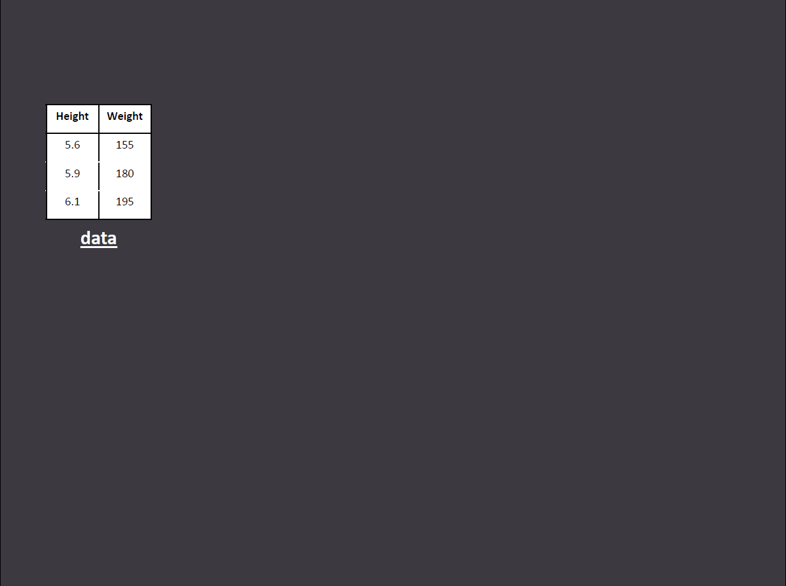

```{r setup, echo=FALSE}
library(knitr)
#library(highlight)
library(ggplot2)
#library(ggthemes)
opts_chunk$set(cache = TRUE, fig.align = 'right')

year <- c(2005, 2005, 2005, 2005, 2005)
state <- c("FL", "MI", "NJ", "NV", "VT")
stores <- c(174, 76, 41, 22, 4) 
mini_walmart <- data.frame(year, state, stores)
```

## Objective: Understand the gg framework

<q>Ggplot2 is an __amazing__ tool for static data visualization. It is not necessarily obvious to realize how powerful it is until you get a strong understanding of its underlying logic though: The Grammar of Graphics. Using ggplot2 without understanding its underlying logic is possible, like going to see a 3D movie without your 3D glasses... You can certainly do it, but don't expect to get the full experience.</q>

---

## Setup
  
```
author("myDeck")
```

--- bg:lightgoldenrodyellow

## PRACTICE TIME!!


DRAW A SCATTER PLOT OF THE FOLLOWING DATASET

---  


## PRACTICE TIME!!


DESCRIBE THE STEPS YOU TOOK TO DRAW THE PLOT

--- 

## Scatter plots: STEP 1

Start with your data set.



--- 


## Scatter plots: STEP 2


--- 

## Scatter plots: STEP 3


--- 

## Scatter plots: STEP 4


--- 

## Scatter plots: STEP 5


--- 

## Grammar of graphic summary


--- 

## DATA


--- 

## Data

```{r, echo = FALSE}
mini_walmart[,1:3]
```

* Code
```{r, eval = FALSE}
data = mini_walmart
```

***

--- 

## AESTHETIC MAPPING


--- 

## Aesthetics: position

```{r, echo = FALSE}
mini_walmart[,1:3]
```

```{r, eval = FALSE}
aes(x = state,y = stores)
data = mini_walmart
```

***

--- 

## Next slide
