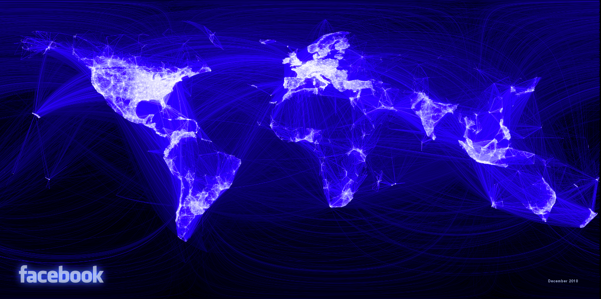
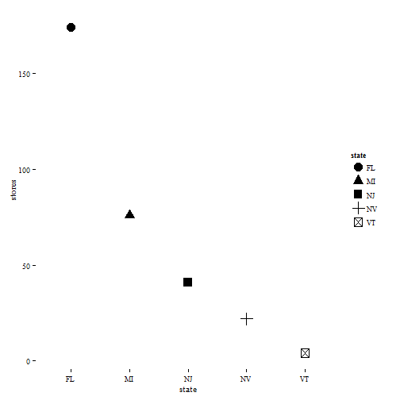

Dataviz with R
========================================================
author: ggplot2 & the grammar of graphics
transition: rotate
transition-speed: slow
width: 1440
height: 900
incremental: true
date: June 03, 2014
css: ./theme/my_style.css

<small> Tony Fujs </small>


========================================================
incremental: false

# Dataviz tools?

WHY USE R & ggplot2?
========================================================
* Flexible
* Powerful

WHY USE R & ggplot2?
========================================================


WHY USE R & ggplot2?
========================================================


WHY USE R & ggplot2?
========================================================


WHY USE R & ggplot2?
========================================================
* Flexible
* Powerful
* Scaling

Difference between this plot...
========================================================


and this plot?
========================================================


ONE LINE OF CODE!!
========================================================

## facet_wrap(~year)

WHY USE R & ggplot2?
========================================================

* Flexible
* Powerful
* Scaling
* Reproducible work

WHY USE R & ggplot2?
========================================================
incremental: false

* Flexible
* Powerful
* Scaling
* Reproducible work
* Building block for other tools (lyra, ggvis, SPSS)


What is ggplot2?
========================================================
* R package (Tool in the R toolbox)
* Rely on the Grammar of Graphics (gg)

***


Barriers to entry
========================================================
* R: From point & click to writing code
* Learning Grammar of Graphics (gg) - as opposed to typology


Objective of the workshop
========================================================

### Remove those barriers
* Understand the gg framework
* Play with simple code

How do we do it?
========================================================
incremental: false

1. gg theory

***


How do we do it?
========================================================
incremental: false

1. gg theory
2. create simple plots

***


How do we do it?
========================================================
incremental: false

1. gg theory
2. create simple plots
3. create complex plot(s)

***


Napoleon's Russian Campaign: Original
========================================================


Napoleon's Russian Campaign: ggplot2
========================================================


Small multiples: Walmart stores
========================================================


========================================================
incremental: false
type: practice

PRACTICE TIME!!


DRAW A SCATTER PLOT OF THE FOLLOWING DATASET

========================================================
incremental: false
type: practice

PRACTICE TIME!!


DESCRIBE THE STEPS YOU TOOK TO DRAW THE PLOT

Scatter plots: STEP 1
========================================================


Scatter plots: STEP 2
========================================================


Scatter plots: STEP 3
========================================================


Scatter plots: STEP 4
========================================================


Scatter plots: STEP 5
========================================================


Grammar of graphic summary
========================================================


DATA
====================================


DATA
====================================


```
  year state stores
1 2005    FL    174
2 2005    MI     76
3 2005    NJ     41
4 2005    NV     22
5 2005    VT      4
```

* Code
<pre><code class="r"><b>data = mini_walmart</b></code></pre>

***


AESTHETIC MAPPING
====================================


AESTHETICS: POSITION
====================================


```
  year state stores
1 2005    FL    174
2 2005    MI     76
3 2005    NJ     41
4 2005    NV     22
5 2005    VT      4
```

<pre><code class="r">
<b>aes(x = state,y = stores)</b>
data = mini_walmart
</code></pre>

***

Aesthetics: position
====================================
incremental: false


```
  year state stores
1 2005    FL    174
2 2005    MI     76
3 2005    NJ     41
4 2005    NV     22
5 2005    VT      4
```

<pre><code class="r">
<b>aes(x = state,y = stores)</b>
data = mini_walmart
</code></pre>

***


Aesthetics: color
====================================


```
  year state stores
1 2005    FL    174
2 2005    MI     76
3 2005    NJ     41
4 2005    NV     22
5 2005    VT      4
```

<pre><code class="r">
aes(x = state,y = stores,
   <b>color = stores</b>)
data = mini_walmart
</code></pre>

***


Aesthetics: color
====================================


```
  year state stores
1 2005    FL    174
2 2005    MI     76
3 2005    NJ     41
4 2005    NV     22
5 2005    VT      4
```

<pre><code class="r">
aes(x = state,y = stores,
   <b>color = states</b>)
data = mini_walmart
</code></pre>

***


Aesthetics: shape
====================================


```
  year state stores
1 2005    FL    174
2 2005    MI     76
3 2005    NJ     41
4 2005    NV     22
5 2005    VT      4
```

<pre><code class="r">
aes(x = state,y = stores,
  <b>shape = state</b>)
data = mini_walmart
</code></pre>

***


PRACTICE TIME!!
====================================
type: practice


```
  year state stores
1 2005    FL    174
2 2005    MI     76
3 2005    NJ     41
4 2005    NV     22
5 2005    VT      4
```

<pre><code class="r">
<b>#COMPLETE THE CODE TO PRODUCE THIS PLOT</b>
aes(x = state,y = stores)
data = mini_walmart
</code></pre>

***



PRACTICE TIME!!
====================================
type: practice
incremental: false


```
  year state stores
1 2005    FL    174
2 2005    MI     76
3 2005    NJ     41
4 2005    NV     22
5 2005    VT      4
```

<pre><code class="r">
#COMPLETE THE CODE TO PRODUCE THIS PLOT
aes(x = state,y = stores,
   <b>color = state,
   shape = state</b>)
data = mini_walmart
</code></pre>

***


PRACTICE TIME!!
====================================
type: practice


```
  year state stores
1 2005    FL    174
2 2005    MI     76
3 2005    NJ     41
4 2005    NV     22
5 2005    VT      4
```

<pre><code class="r">
<b># WHAT ADDITIONAL AESTHETIC MAPPING IS NEEDED TO PRODUCE THIS PLOT?</b>
aes(x = state,y = stores)
data = mini_walmart
</code></pre>

***


PRACTICE TIME!!
====================================
type: practice
incremental: false


```
  year state stores
1 2005    FL    174
2 2005    MI     76
3 2005    NJ     41
4 2005    NV     22
5 2005    VT      4
```

<pre><code class="r">
# WHAT ADDITIONAL AESTHETIC MAPPING IS NEEDED TO PRODUCE THIS PLOT?
aes(x = state,y = stores,
   <b>size = stores</b>)
data = mini_walmart
</code></pre>

***


SCALE
====================================


Scale: position (default)
====================================
incremental: false


```
  year state stores
1 2005    FL    174
2 2005    MI     76
3 2005    NJ     41
4 2005    NV     22
5 2005    VT      4
```

<pre><code class="r">
aes(x = state,y = stores)
data = mini_walmart
</code></pre>

***


Scale: position (default)
====================================
incremental: false


```
  year state stores
1 2005    FL    174
2 2005    MI     76
3 2005    NJ     41
4 2005    NV     22
5 2005    VT      4
```

<pre><code class="r">
aes(x = state,y = stores)
data = mini_walmart 
<b>scale_y_continuous()</b>
</code></pre>

***


Scale: position (log)
=====================================


```
  year state stores
1 2005    FL    174
2 2005    MI     76
3 2005    NJ     41
4 2005    NV     22
5 2005    VT      4
```

<pre><code class="r">
aes(x = state,y = stores)
data = mini_walmart 
<b>scale_y_log10()</b>
</code></pre>

***


Scale: color
====================================
incremental: false


```
  year state stores
1 2005    FL    174
2 2005    MI     76
3 2005    NJ     41
4 2005    NV     22
5 2005    VT      4
```

<pre><code class="r">
aes(x = state,y = stores,
   <b>color = stores</b>)
data = mini_walmart 
</code></pre>

***


Scale: color
====================================
incremental: false


```
  year state stores
1 2005    FL    174
2 2005    MI     76
3 2005    NJ     41
4 2005    NV     22
5 2005    VT      4
```

<pre><code class="r">
aes(x = state,y = stores,
    color = stores)
data = mini_walmart
<b>scale_color_continuous()</b>
</code></pre>

***


Scale: color
====================================


```
  year state stores
1 2005    FL    174
2 2005    MI     76
3 2005    NJ     41
4 2005    NV     22
5 2005    VT      4
```

<pre><code class="r">
aes(x = state,y = stores,
    color = stores)
data = mini_walmart
<b>scale_color_continuous(
  low = 'light green',
  high = 'dark green')</b>
</code></pre>

***


Geometric objects: point
===================================


Geometric objects: point
====================================


```
  year state stores
1 2005    FL    174
2 2005    MI     76
3 2005    NJ     41
4 2005    NV     22
5 2005    VT      4
```

<pre><code class="r">
aes(x = state,y = stores)
data = mini_walmart
</code></pre>

***


Geometric objects: point
====================================
incremental: false


```
  year state stores
1 2005    FL    174
2 2005    MI     76
3 2005    NJ     41
4 2005    NV     22
5 2005    VT      4
```

<pre><code class="r">
aes(x = state,y = stores)
data = mini_walmart
<b>geom_point()</b>
</code></pre>

***


Geometric objects: bar
====================================
incremental: false


```
  year state stores
1 2005    FL    174
2 2005    MI     76
3 2005    NJ     41
4 2005    NV     22
5 2005    VT      4
```

<pre><code class="r">
aes(x = state,y = stores)
data = mini_walmart
<b>geom_bar()</b>
</code></pre>

***

TAKE A GUESS:
WHAT WILL THIS PLOT LOOK LIKE?


Geometric objects: bar
====================================
incremental: false


```
  year state stores
1 2005    FL    174
2 2005    MI     76
3 2005    NJ     41
4 2005    NV     22
5 2005    VT      4
```

<pre><code class="r">
aes(x = state,y = stores)
data = mini_walmart
<b>geom_bar()</b>
</code></pre>

***


PRACTICE TIME!!
====================================
type: practice
incremental: false


```
  year state stores
1 2005    FL    174
2 2005    MI     76
3 2005    NJ     41
4 2005    NV     22
5 2005    VT      4
```

<pre><code class="r">
<b># COMPLETE THE CODE TO PRODUCE THIS PLOT</b>
aes(x = state,y = stores)
data = mini_walmart
</code></pre>

***


PRACTICE TIME!!
====================================
type: practice
incremental: false


```
  year state stores
1 2005    FL    174
2 2005    MI     76
3 2005    NJ     41
4 2005    NV     22
5 2005    VT      4
```

<pre><code class="r">
# COMPLETE THE CODE TO PRODUCE THIS PLOT
aes(x = state,y = stores)
data = mini_walmart
<b>geom_line()</b>
</code></pre>

***


Geometric objects: text
====================================
incremental: false


```
  year state stores
1 2005    FL    174
2 2005    MI     76
3 2005    NJ     41
4 2005    NV     22
5 2005    VT      4
```

<pre><code class="r">
aes(x = state,y = stores)
data = mini_walmart
<b>geom_text()</b>
</code></pre>

***

TAKE A GUESS:
WHAT WILL THIS PLOT LOOK LIKE?


Geometric objects: text
====================================
incremental: false


```
  year state stores
1 2005    FL    174
2 2005    MI     76
3 2005    NJ     41
4 2005    NV     22
5 2005    VT      4
```

<pre><code class="r">
aes(x = state,y = stores)
data = mini_walmart
<b>geom_text()</b>
</code></pre>

***

~~Error: geom_text requires the following missing aesthetics: label~~


Geometric objects: text
====================================
incremental: false


```
  year state stores
1 2005    FL    174
2 2005    MI     76
3 2005    NJ     41
4 2005    NV     22
5 2005    VT      4
```

<pre><code class="r">
aes(x = state,y = stores,
  <b>label = stores</b>)
data = mini_walmart
geom_text()
</code></pre>

***


Position adjustment: identity
====================================


Position adjustment: identity
====================================


```
  year state stores
1 2005    FL    174
2 2005    MI     76
3 2005    NJ     41
4 2005    NV     22
5 2005    VT      4
```

<pre><code class="r">
aes(x = year,y = stores)
data = mini_walmart
geom_point()
</code></pre>

***


Position adjustment: identity
====================================
incremental: false


```
  year state stores
1 2005    FL    174
2 2005    MI     76
3 2005    NJ     41
4 2005    NV     22
5 2005    VT      4
```

<pre><code class="r">
aes(x = year,y = stores)
data = mini_walmart
geom_point()
<b>position = 'identity'</b>
</code></pre>

***


Position adjustment: identity
====================================
incremental: false


```
  year state stores
1 2005    FL    174
2 2005    MI     76
3 2005    NJ     41
4 2005    NV     22
5 2005    VT      4
```

<pre><code class="r">
aes(x = year,y = stores)
data = mini_walmart
<b>geom_bar()
position = identity</b>
</code></pre>

***

TAKE A GUESS: WHAT WILL THIS PLOT LOOK LIKE?


Position adjustment: identity
====================================
incremental: false


```
  year state stores
1 2005    FL    174
2 2005    MI     76
3 2005    NJ     41
4 2005    NV     22
5 2005    VT      4
```

<pre><code class="r">
aes(x = year,y = stores)
data = mini_walmart
geom_bar()
<b>position = identity</b>
</code></pre>

***


Position adjustment: identity
====================================
incremental: false


```
  year state stores
1 2005    FL    174
2 2005    MI     76
3 2005    NJ     41
4 2005    NV     22
5 2005    VT      4
```

<pre><code class="r">
aes(x = year,y = stores,
   <b>fill = state</b>)
data = mini_walmart
geom_bar()
position = identity
</code></pre>

***


Position adjustment: identity
====================================
incremental: false


```
  year state stores
1 2005    FL    174
2 2005    MI     76
3 2005    NJ     41
4 2005    NV     22
5 2005    VT      4
```

<pre><code class="r">
aes(x = year,y = stores,
   <b>fill = state</b>)
data = mini_walmart
geom_bar()
position = identity
</code></pre>

***


Position adjustment: identity
====================================
incremental: false


```
  year state stores
1 2005    FL    174
2 2005    MI     76
3 2005    NJ     41
4 2005    NV     22
5 2005    VT      4
```

<pre><code class="r">
aes(x = year,y = stores,
   <b>fill = state</b>)
data = mini_walmart
geom_bar()
position = identity
</code></pre>

***


Position adjustment: identity
====================================
incremental: false


```
  year state stores
1 2005    FL    174
2 2005    MI     76
3 2005    NJ     41
4 2005    NV     22
5 2005    VT      4
```

<pre><code class="r">
aes(x = year,y = stores,
   <b>fill = state</b>)
data = mini_walmart
geom_bar()
position = identity
</code></pre>

***


Position adjustment: identity
====================================
incremental: false


```
  year state stores
1 2005    FL    174
2 2005    MI     76
3 2005    NJ     41
4 2005    NV     22
5 2005    VT      4
```

<pre><code class="r">
aes(x = year,y = stores,
   <b>fill = state</b>)
data = mini_walmart
geom_bar()
position = identity
</code></pre>

***


Position adjustment: identity
====================================
incremental: false


```
  year state stores
1 2005    FL    174
2 2005    MI     76
3 2005    NJ     41
4 2005    NV     22
5 2005    VT      4
```

<pre><code class="r">
aes(x = year,y = stores,
   <b>fill = state</b>)
data = mini_walmart
geom_bar()
position = identity
</code></pre>

***


Position adjustment: dodge
====================================


```
  year state stores
1 2005    FL    174
2 2005    MI     76
3 2005    NJ     41
4 2005    NV     22
5 2005    VT      4
```

<pre><code class="r">
aes(x = year,y = stores,
   fill = state)
data = mini_walmart
geom_bar()
<b>position = dodge</b>
</code></pre>

***


Position adjustment: stack
====================================


```
  year state stores
1 2005    FL    174
2 2005    MI     76
3 2005    NJ     41
4 2005    NV     22
5 2005    VT      4
```

<pre><code class="r">
aes(x = year,y = stores,
    fill = state)
data = mini_walmart
geom_bar()
<b>position = stack</b>
</code></pre>

***


Position adjustment: fill
====================================


```
  year state stores
1 2005    FL    174
2 2005    MI     76
3 2005    NJ     41
4 2005    NV     22
5 2005    VT      4
```

<pre><code class="r">
aes(x = year,y = stores,
    fill = state)
data = mini_walmart
geom_bar()
<b>position = fill</b>
</code></pre>

***


COORDINATE SYSTEM: cartesian
====================================


COORDINATE SYSTEM: cartesian
====================================


```
  year state stores
1 2005    FL    174
2 2005    MI     76
3 2005    NJ     41
4 2005    NV     22
5 2005    VT      4
```

<pre><code class="r">
aes(x = year,y = stores,
   fill = state)
data = mini_walmart
geom_bar()
position = fill
</code></pre>

***


COORDINATE SYSTEM: cartesian
====================================


```
  year state stores
1 2005    FL    174
2 2005    MI     76
3 2005    NJ     41
4 2005    NV     22
5 2005    VT      4
```

<pre><code class="r">
aes(x = year,y = stores,
   fill = state)
data = mini_walmart
geom_bar()
position = fill
<b>coord_cartesian()</b>
</code></pre>

***


COORDINATE SYSTEM: cartesian
====================================
incremental: false


```
  year state stores
1 2005    FL    174
2 2005    MI     76
3 2005    NJ     41
4 2005    NV     22
5 2005    VT      4
```

<pre><code class="r">
aes(x = year,y = stores,
    fill = state)
data = mini_walmart
geom_bar()
position = fill
<b>coord_polar()</b>
</code></pre>

***

TAKE A GUESS:
WHAT WILL THIS PLOT LOOK LIKE?


COORDINATE SYSTEM: cartesian
====================================
incremental: false


```
  year state stores
1 2005    FL    174
2 2005    MI     76
3 2005    NJ     41
4 2005    NV     22
5 2005    VT      4
```

<pre><code class="r">
aes(x = year,y = stores,
    fill = state)
data = mini_walmart
geom_bar()
position = fill
<b>coord_polar()</b>
</code></pre>

***


====================================
incremental: false
type: practice

PRACTICE TIME!!


ADD A REGRESSION LINE TO YOUR HAND DRAWN SCATTER PLOT

STATISTICAL TRANSFORMATION
====================================


STATISTICAL TRANSFORMATION
====================================


STATISTICAL TRANSFORMATION
====================================


STATISTICAL TRANSFORMATION
====================================


STATISTICAL TRANSFORMATION: identity
====================================


```
  year state stores share
1 2005    FL    174  0.40
2 2005    MI     76  0.30
3 2005    NJ     41  0.15
4 2005    NV     22  0.10
5 2005    VT      4  0.05
```

<pre><code class="r">
aes(x = stores, y = share)
data = mini_walmart
geom_point()
</code></pre>

***


STATISTICAL TRANSFORMATION: identity
====================================


```
  year state stores share
1 2005    FL    174  0.40
2 2005    MI     76  0.30
3 2005    NJ     41  0.15
4 2005    NV     22  0.10
5 2005    VT      4  0.05
```

<pre><code class="r">
aes(x = stores, y = share)
data = mini_walmart
geom_point(<b>stat = 'identity'</b>)
</code></pre>

***


STATISTICAL TRANSFORMATION: smooth
====================================


```
  year state stores share
1 2005    FL    174  0.40
2 2005    MI     76  0.30
3 2005    NJ     41  0.15
4 2005    NV     22  0.10
5 2005    VT      4  0.05
```

<pre><code class="r">
aes(x = stores, y = share)
data = mini_walmart
geom_point(<b>stat = 'smooth'</b>)
</code></pre>

***


STATISTICAL TRANSFORMATION: smooth
====================================


```
  year state stores share
1 2005    FL    174  0.40
2 2005    MI     76  0.30
3 2005    NJ     41  0.15
4 2005    NV     22  0.10
5 2005    VT      4  0.05
```

<pre><code class="r">
aes(x = stores, y = share)
data = mini_walmart
<b>geom_line</b>(stat = 'smooth')
</code></pre>

***


LAYER
====================================


```
  year state stores share
1 2005    FL    174  0.40
2 2005    MI     76  0.30
3 2005    NJ     41  0.15
4 2005    NV     22  0.10
5 2005    VT      4  0.05
```

<pre><code class="r">
aes(x = stores, y = share)
data = mini_walmart
<b>geom_point(stat = 'identity')</b>
</code></pre>

***


LAYER
====================================


```
  year state stores share
1 2005    FL    174  0.40
2 2005    MI     76  0.30
3 2005    NJ     41  0.15
4 2005    NV     22  0.10
5 2005    VT      4  0.05
```

<pre><code class="r">
aes(x = stores, y = share)
data = mini_walmart
<b>geom_point(stat = 'identity') +
geom_line(stat = 'smooth')</b>
</code></pre>

***


LAYER
====================================


