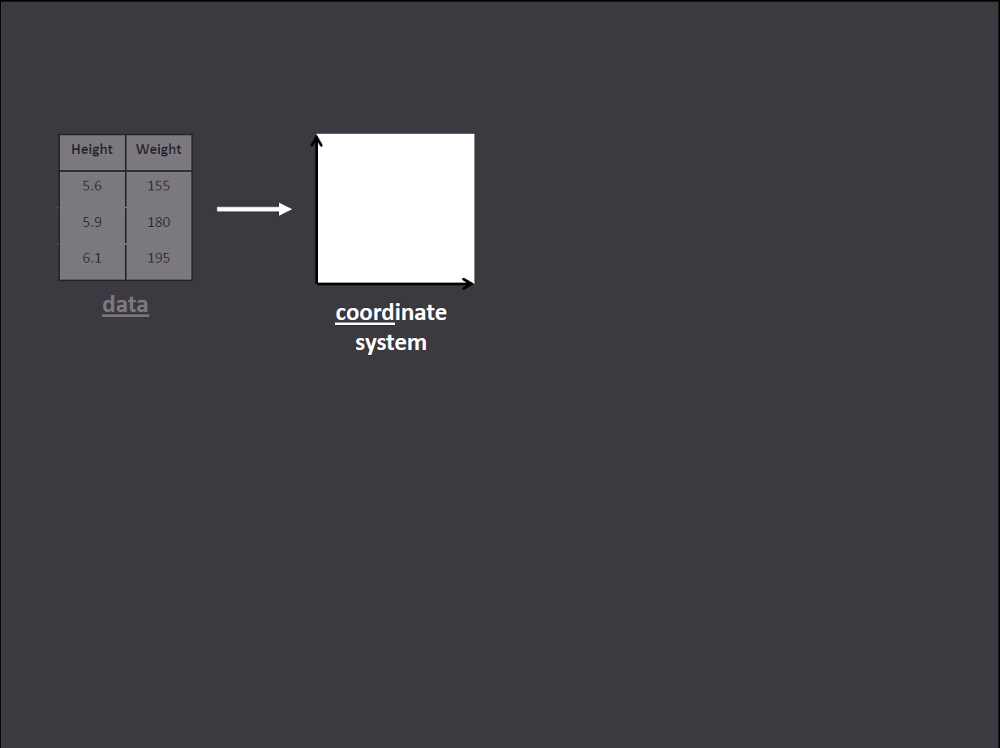

Dataviz with R
========================================================
author: ggplot2 & the grammar of graphics
transition: rotate
transition-speed: slow
width: 1440
height: 900
incremental: true
date: June 03, 2014
css: ./theme/my_style.css

<small> Tony Fujs </small>


========================================================
incremental: false

# Dataviz tools?

WHY USE R & ggplot2?
========================================================
* Flexible
* Powerful

WHY USE R & ggplot2?
========================================================


WHY USE R & ggplot2?
========================================================


WHY USE R & ggplot2?
========================================================


WHY USE R & ggplot2?
========================================================
* Flexible
* Powerful
* Scaling

Difference between this plot...
========================================================


and this plot?
========================================================


ONE LINE OF CODE!!
========================================================

## facet_wrap(~year)

WHY USE R & ggplot2?
========================================================

* Flexible
* Powerful
* Scaling
* Reproducible work

WHY USE R & ggplot2?
========================================================
incremental: false

* Flexible
* Powerful
* Scaling
* Reproducible work
* Building block for other tools (lyra, ggvis, SPSS)


What is ggplot2?
========================================================
* R package (Tool in the R toolbox)
* Rely on the Grammar of Graphics (gg)

***


Barriers to entry
========================================================
* R: From point & click to writing code
* Learning Grammar of Graphics (gg) - as opposed to typology


Objective of the workshop
========================================================

### Remove those barriers
* Understand the gg framework
* Play with simple code

How do we do it?
========================================================
incremental: false

1. gg theory

***


How do we do it?
========================================================
incremental: false

1. gg theory
2. create simple plots

***


How do we do it?
========================================================
incremental: false

1. gg theory
2. create simple plots
3. create complex plot(s)

***


Napoleon's Russian Campaign: Original
========================================================


Napoleon's Russian Campaign: ggplot2
========================================================


Small multiples: Walmart stores
========================================================


========================================================
incremental: false
type: practice

PRACTICE TIME!!


DRAW A SCATTER PLOT OF THE FOLLOWING DATASET

========================================================
incremental: false
type: practice

PRACTICE TIME!!


DESCRIBE THE STEPS YOU TOOK TO DRAW THE PLOT

Scatter plots: STEP 1
========================================================


Scatter plots: STEP 2
========================================================



Scatter plots: STEP 3
========================================================


Scatter plots: STEP 4
========================================================


Scatter plots: STEP 5
========================================================


Grammar of graphic summary
========================================================


DATA
====================================


Data
====================================


```
  year state stores
1 2005    FL    174
2 2005    MI     76
3 2005    NJ     41
4 2005    NV     22
5 2005    VT      4
```


* Code

```r
data = mini_walmart
```


***

<pre><code class="r">
ggplot() + 
geom_point(
 aes(x = state,y = stores),
 <b>data = mini_walmart</b>)
</code></pre>

AESTHETIC MAPPING
====================================


Aesthetics: position
====================================


```
  year state stores
1 2005    FL    174
2 2005    MI     76
3 2005    NJ     41
4 2005    NV     22
5 2005    VT      4
```


```r
aes(x = state,y = stores)
data = mini_walmart
```


***

Aesthetics: position
====================================
incremental: false


```
  year state stores
1 2005    FL    174
2 2005    MI     76
3 2005    NJ     41
4 2005    NV     22
5 2005    VT      4
```


```r
aes(x = state,y = stores)
data = mini_walmart
```


***


Aesthetics: color
====================================


```
  year state stores
1 2005    FL    174
2 2005    MI     76
3 2005    NJ     41
4 2005    NV     22
5 2005    VT      4
```


```r
aes(x = state,y = stores,
    color = stores)
data = mini_walmart
```


***


Aesthetics: color
====================================


```
  year state stores
1 2005    FL    174
2 2005    MI     76
3 2005    NJ     41
4 2005    NV     22
5 2005    VT      4
```


```r
aes(x = state,y = stores,
    color = state)
data = mini_walmart
```


***


Aesthetics: shape
====================================


```
  year state stores
1 2005    FL    174
2 2005    MI     76
3 2005    NJ     41
4 2005    NV     22
5 2005    VT      4
```


```r
aes(x = state,y = stores,
    shape = state)
data = mini_walmart
```


***


PRACTICE TIME!!
====================================
type: practice


```
  year state stores
1 2005    FL    174
2 2005    MI     76
3 2005    NJ     41
4 2005    NV     22
5 2005    VT      4
```


```r
#COMPLETE THE CODE TO PRODUCE THIS PLOT
aes(x = state,y = stores)
data = mini_walmart
```


***


PRACTICE TIME!!
====================================
type: practice
incremental: false


```
  year state stores
1 2005    FL    174
2 2005    MI     76
3 2005    NJ     41
4 2005    NV     22
5 2005    VT      4
```


```r
#COMPLETE THE CODE TO PRODUCE THIS PLOT
aes(x = state,y = stores,
    color = state,
    shape = state)
data = mini_walmart
```


***


PRACTICE TIME!!
====================================
type: practice


```
  year state stores
1 2005    FL    174
2 2005    MI     76
3 2005    NJ     41
4 2005    NV     22
5 2005    VT      4
```


```r
# WHAT ADDITIONAL AESTHETIC MAPPING IS NEEDED TO PRODUCE THIS PLOT?
aes(x = state,y = stores)
data = mini_walmart
```


***


PRACTICE TIME!!
====================================
type: practice
incremental: false


```
  year state stores
1 2005    FL    174
2 2005    MI     76
3 2005    NJ     41
4 2005    NV     22
5 2005    VT      4
```


```r
# WHAT ADDITIONAL AESTHETIC MAPPING IS NEEDED TO PRODUCE THIS PLOT?
aes(x = state,y = stores,
    size = stores)
data = mini_walmart
```


***


SCALE
====================================


Scale: position (default)
====================================
incremental: false


```
  year state stores
1 2005    FL    174
2 2005    MI     76
3 2005    NJ     41
4 2005    NV     22
5 2005    VT      4
```


```r
aes(x = state,y = stores)
data = mini_walmart
```


***


Scale: position (default)
====================================
incremental: false


```
  year state stores
1 2005    FL    174
2 2005    MI     76
3 2005    NJ     41
4 2005    NV     22
5 2005    VT      4
```


```r
aes(x = state,y = stores)
data = mini_walmart 
scale_y_continuous()
```


***


Scale: position (log)
=====================================


```
  year state stores
1 2005    FL    174
2 2005    MI     76
3 2005    NJ     41
4 2005    NV     22
5 2005    VT      4
```


```r
aes(x = state,y = stores)
data = mini_walmart 
scale_y_log10()
```


***


Scale: color
====================================
incremental: false


```
  year state stores
1 2005    FL    174
2 2005    MI     76
3 2005    NJ     41
4 2005    NV     22
5 2005    VT      4
```


```r
aes(x = state,y = stores,
    color = stores)
data = mini_walmart 
```


***


Scale: color
====================================
incremental: false


```
  year state stores
1 2005    FL    174
2 2005    MI     76
3 2005    NJ     41
4 2005    NV     22
5 2005    VT      4
```


```r
aes(x = state,y = stores,
    color = stores)
data = mini_walmart
scale_color_continuous()
```


***


Scale: color
====================================


```
  year state stores
1 2005    FL    174
2 2005    MI     76
3 2005    NJ     41
4 2005    NV     22
5 2005    VT      4
```


```r
aes(x = state,y = stores,
    color = stores)
data = mini_walmart
scale_color_continuous(
  low = 'light green',
  high = 'dark green')
```


***


Geometric objects: point
===================================


Geometric objects: point
====================================


```
  year state stores
1 2005    FL    174
2 2005    MI     76
3 2005    NJ     41
4 2005    NV     22
5 2005    VT      4
```


```r
aes(x = state,y = stores)
data = mini_walmart
```


***


Geometric objects: point
====================================
incremental: false


```
  year state stores
1 2005    FL    174
2 2005    MI     76
3 2005    NJ     41
4 2005    NV     22
5 2005    VT      4
```


```r
aes(x = state,y = stores)
data = mini_walmart
geom_point()
```


***


Geometric objects: bar
====================================
incremental: false


```
  year state stores
1 2005    FL    174
2 2005    MI     76
3 2005    NJ     41
4 2005    NV     22
5 2005    VT      4
```


```r
aes(x = state,y = stores)
data = mini_walmart
geom_bar()
```


***

TAKE A GUESS:
WHAT WILL THIS PLOT LOOK LIKE?


Geometric objects: bar
====================================
incremental: false


```
  year state stores
1 2005    FL    174
2 2005    MI     76
3 2005    NJ     41
4 2005    NV     22
5 2005    VT      4
```


```r
aes(x = state,y = stores)
data = mini_walmart
geom_bar()
```


***


PRACTICE TIME!!
====================================
type: practice
incremental: false


```
  year state stores
1 2005    FL    174
2 2005    MI     76
3 2005    NJ     41
4 2005    NV     22
5 2005    VT      4
```


```r
# COMPLETE THE CODE TO PRODUCE THIS PLOT
aes(x = state,y = stores)
data = mini_walmart
```


***


PRACTICE TIME!!
====================================
type: practice
incremental: false


```
  year state stores
1 2005    FL    174
2 2005    MI     76
3 2005    NJ     41
4 2005    NV     22
5 2005    VT      4
```


```r
# COMPLETE THE CODE TO PRODUCE THIS PLOT
aes(x = state,y = stores)
data = mini_walmart
geom_line()
```


***


Geometric objects: text
====================================
incremental: false


```
  year state stores
1 2005    FL    174
2 2005    MI     76
3 2005    NJ     41
4 2005    NV     22
5 2005    VT      4
```


```r
aes(x = state,y = stores)
data = mini_walmart
geom_text()
```


***

TAKE A GUESS:
WHAT WILL THIS PLOT LOOK LIKE?


Geometric objects: text
====================================
incremental: false


```
  year state stores
1 2005    FL    174
2 2005    MI     76
3 2005    NJ     41
4 2005    NV     22
5 2005    VT      4
```


```r
aes(x = state,y = stores)
data = mini_walmart
geom_text()
```


***

~~Error: geom_text requires the following missing aesthetics: label~~


Geometric objects: text
====================================
incremental: false


```
  year state stores
1 2005    FL    174
2 2005    MI     76
3 2005    NJ     41
4 2005    NV     22
5 2005    VT      4
```


```r
aes(x = state,y = stores,
    label = stores)
data = mini_walmart
geom_text()
```


***


Position adjustment: identity
====================================


Position adjustment: identity
====================================


```
  year state stores
1 2005    FL    174
2 2005    MI     76
3 2005    NJ     41
4 2005    NV     22
5 2005    VT      4
```


```r
aes(x = year,y = stores)
data = mini_walmart
geom_point()
```


***


Position adjustment: identity
====================================
incremental: false


```
  year state stores
1 2005    FL    174
2 2005    MI     76
3 2005    NJ     41
4 2005    NV     22
5 2005    VT      4
```


```r
aes(x = year,y = stores)
data = mini_walmart
geom_point()
position = 'identity'
```


***


Position adjustment: identity
====================================
incremental: false


```
  year state stores
1 2005    FL    174
2 2005    MI     76
3 2005    NJ     41
4 2005    NV     22
5 2005    VT      4
```


```r
aes(x = year,y = stores)
data = mini_walmart
geom_bar()
position = identity
```


***

TAKE A GUESS: WHAT WILL THIS PLOT LOOK LIKE?


Position adjustment: identity
====================================
incremental: false


```
  year state stores
1 2005    FL    174
2 2005    MI     76
3 2005    NJ     41
4 2005    NV     22
5 2005    VT      4
```


```r
aes(x = year,y = stores)
data = mini_walmart
geom_bar()
position = identity
```


***


Position adjustment: identity
====================================
incremental: false


```
  year state stores
1 2005    FL    174
2 2005    MI     76
3 2005    NJ     41
4 2005    NV     22
5 2005    VT      4
```


```r
aes(x = year,y = stores,
    fill = state)
data = mini_walmart
geom_bar()
position = identity
```


***


Position adjustment: identity
====================================
incremental: false


```
  year state stores
1 2005    FL    174
2 2005    MI     76
3 2005    NJ     41
4 2005    NV     22
5 2005    VT      4
```


```r
aes(x = year,y = stores,
    fill = state)
data = mini_walmart
geom_bar()
position = identity
```


***


Position adjustment: identity
====================================
incremental: false


```
  year state stores
1 2005    FL    174
2 2005    MI     76
3 2005    NJ     41
4 2005    NV     22
5 2005    VT      4
```


```r
aes(x = year,y = stores,
    fill = state)
data = mini_walmart
geom_bar()
position = identity
```


***


Position adjustment: identity
====================================
incremental: false


```
  year state stores
1 2005    FL    174
2 2005    MI     76
3 2005    NJ     41
4 2005    NV     22
5 2005    VT      4
```


```r
aes(x = year,y = stores,
    fill = state)
data = mini_walmart
geom_bar()
position = identity
```


***


Position adjustment: identity
====================================
incremental: false


```
  year state stores
1 2005    FL    174
2 2005    MI     76
3 2005    NJ     41
4 2005    NV     22
5 2005    VT      4
```


```r
aes(x = year,y = stores,
    fill = state)
data = mini_walmart
geom_bar()
position = identity
```


***


Position adjustment: identity
====================================
incremental: false


```
  year state stores
1 2005    FL    174
2 2005    MI     76
3 2005    NJ     41
4 2005    NV     22
5 2005    VT      4
```


```r
aes(x = year,y = stores,
    fill = state)
data = mini_walmart
geom_bar()
position = identity
```


***


Position adjustment: dodge
====================================


```
  year state stores
1 2005    FL    174
2 2005    MI     76
3 2005    NJ     41
4 2005    NV     22
5 2005    VT      4
```


```r
aes(x = year,y = stores,
    fill = state)
data = mini_walmart
geom_bar()
position = dodge
```


***


Position adjustment: stack
====================================


```
  year state stores
1 2005    FL    174
2 2005    MI     76
3 2005    NJ     41
4 2005    NV     22
5 2005    VT      4
```


```r
aes(x = year,y = stores,
    fill = state)
data = mini_walmart
geom_bar()
position = stack
```


***


Position adjustment: fill
====================================


```
  year state stores
1 2005    FL    174
2 2005    MI     76
3 2005    NJ     41
4 2005    NV     22
5 2005    VT      4
```


```r
aes(x = year,y = stores,
    fill = state)
data = mini_walmart
geom_bar()
position = fill
```


***


COORDINATE SYSTEM: cartesian
====================================


COORDINATE SYSTEM: cartesian
====================================


```
  year state stores
1 2005    FL    174
2 2005    MI     76
3 2005    NJ     41
4 2005    NV     22
5 2005    VT      4
```


```r
aes(x = year,y = stores,
    fill = state)
data = mini_walmart
geom_bar()
position = fill
```


***


COORDINATE SYSTEM: cartesian
====================================


```
  year state stores
1 2005    FL    174
2 2005    MI     76
3 2005    NJ     41
4 2005    NV     22
5 2005    VT      4
```


```r
aes(x = year,y = stores,
    fill = state)
data = mini_walmart
geom_bar()
position = fill
coord_cartesian()
```


***


COORDINATE SYSTEM: cartesian
====================================
incremental: false


```
  year state stores
1 2005    FL    174
2 2005    MI     76
3 2005    NJ     41
4 2005    NV     22
5 2005    VT      4
```


```r
aes(x = year,y = stores,
    fill = state)
data = mini_walmart
geom_bar()
position = fill
coord_polar()
```


***

TAKE A GUESS:
WHAT WILL THIS PLOT LOOK LIKE?


COORDINATE SYSTEM: cartesian
====================================
incremental: false


```
  year state stores
1 2005    FL    174
2 2005    MI     76
3 2005    NJ     41
4 2005    NV     22
5 2005    VT      4
```


```r
aes(x = year,y = stores,
    fill = state)
data = mini_walmart
geom_bar()
position = fill
coord_polar()
```


***


====================================
incremental: false
type: practice

PRACTICE TIME!!


ADD A REGRESSION LINE TO YOUR HAND DRAWN SCATTER PLOT

STATISTICAL TRANSFORMATION
====================================


STATISTICAL TRANSFORMATION
====================================


STATISTICAL TRANSFORMATION
====================================


STATISTICAL TRANSFORMATION
====================================


STATISTICAL TRANSFORMATION: identity
====================================


```
  year state stores share
1 2005    FL    174  0.40
2 2005    MI     76  0.30
3 2005    NJ     41  0.15
4 2005    NV     22  0.10
5 2005    VT      4  0.05
```


```r
aes(x = stores, y = share)
data = mini_walmart
geom_point()
```


***


STATISTICAL TRANSFORMATION: identity
====================================


```
  year state stores share
1 2005    FL    174  0.40
2 2005    MI     76  0.30
3 2005    NJ     41  0.15
4 2005    NV     22  0.10
5 2005    VT      4  0.05
```


```r
aes(x = stores, y = share)
data = mini_walmart
geom_point(stat = 'identity')
```


***


STATISTICAL TRANSFORMATION: smooth
====================================


```
  year state stores share
1 2005    FL    174  0.40
2 2005    MI     76  0.30
3 2005    NJ     41  0.15
4 2005    NV     22  0.10
5 2005    VT      4  0.05
```


```r
aes(x = stores, y = share)
data = mini_walmart
geom_point(stat = 'smooth')
```


***


STATISTICAL TRANSFORMATION: smooth
====================================


```
  year state stores share
1 2005    FL    174  0.40
2 2005    MI     76  0.30
3 2005    NJ     41  0.15
4 2005    NV     22  0.10
5 2005    VT      4  0.05
```


```r
aes(x = stores, y = share)
data = mini_walmart
geom_line(stat = 'smooth')
```


***


LAYER
====================================


```
  year state stores share
1 2005    FL    174  0.40
2 2005    MI     76  0.30
3 2005    NJ     41  0.15
4 2005    NV     22  0.10
5 2005    VT      4  0.05
```


```r
aes(x = stores, y = share)
data = mini_walmart
geom_point(stat = 'identity')
```


***


LAYER
====================================


```
  year state stores share
1 2005    FL    174  0.40
2 2005    MI     76  0.30
3 2005    NJ     41  0.15
4 2005    NV     22  0.10
5 2005    VT      4  0.05
```


```r
aes(x = stores, y = share)
data = mini_walmart
geom_point(stat = 'identity') +
geom_line(stat = 'smooth')
```


***


LAYER
====================================


